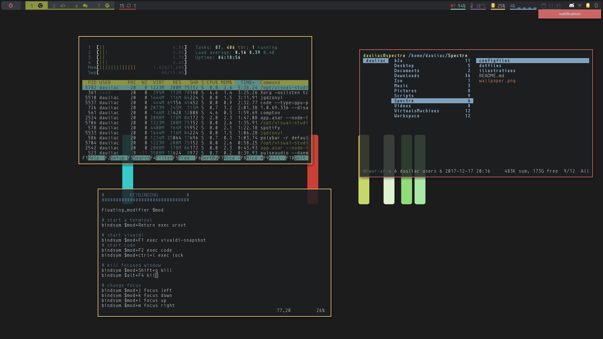
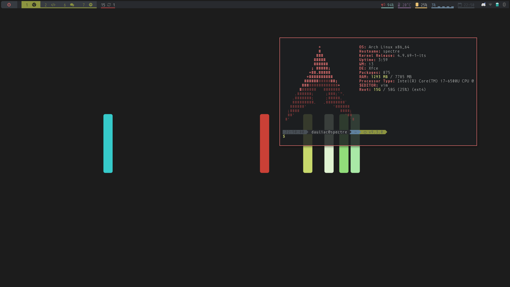
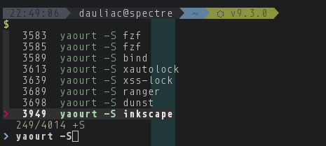

# Spectre

My Arch-Linux Fresh install configuration. Maybe one day I will buil a 'Makefile'.

This is personal and I don't give any support

## ScreenShots

Desktop with htop, ranger, vim, dunst.

Empty desktop.

.Xressources color

Search zsh history with fzf.

## Table of Contents

* [Getting started](#getting-started)
  * [Arch-Anywhere](#arch-anywhere)
  * [Basic config](#basic)
  * [Tools](#tools)
  * [Desktop](#desktop)
  * [Configuration](#configuration)
* [To Do](#todo)

## Getting started

### Arch-Anywhere
Use the last version of **Arch-Anywhere**

- **Download** mirror FR
- **Keyboard** FR
- **Local** en_US.UTF-8
- **Clock** Europe >> Paris
- **Patitioning** :
		gpt
		boot/efi : 512 Mib fat32
		/ : 70Gib minimum ext4
		/home : Maximum ext4
		swap : 16 Gib linuxswap
		/var ext4 on DD if you can for ram
- **kernel** Base
- **shell** zsh >> oh-my-zsh
- **bootloader** grub
- **network manager**
- **add multilib repos**
- **dhcp at startup**
- **add network wifi tools**
- **add os prober**
- **i3 and xfce ?** #TODO
- **input synaptics** for trackpad
- **lightdm** light and i don't know why

### Basic config

- Install Archey3 and my oh-my-zsh/bash/zsh dotfiles
- Install **KeeWeb** for acces to password
- install **Languages** support :
	~~~ sh
	$ yaourt -S nodejs npm python2 python java-environment-common  java-runtime-common pepper-flash php zsh-completions zsh-autosuggestion git'
	~~~

### Tools

- **Terminal :** urxvt
- **Task manager :** htop & stacer
- **Web Browser :** vivaldi snapshot ffmpeg codecs
- **Git GUI :** gitkraken
- **git :** git
- **Music :** Spotify
- **Multimedia :** vlc
- **Partition manager :** Gparted
- **Photo Editor :** Gimp Pencil Vectr
- **Streaming video :** molotov popcorntime
- **VM :** Virtualbox
- **Vocal Chat :** discord
- **utilities :** redshift caffeine
- **GUI paquets manager :** octopi / octopi notifier
- **video editor :** shortcut
- **Keys bootable :** unetbootin
- **File and FTP manager:** Dolphin
- **text editor** : vim / visual studio
- **work :** intellij idea / datagrip / phpstorm
- **Desktop :**

	i3-gaps : windows manager

	xfce tools (wifi/bluetooth/sound/etc)

	compton : windows render

	polybar : status bar

	rofi : launcher

	nitrogen : wallpaper

	lxapearance : theme

	font-awesome : icon font

	gtk theme : gtk-arc-flatabulous-theme-git

	font 1 : ??

	font 2 : ttf-font-awesome

	icon theme paper

	notification : dunst

	terminal : zsh

	trminal search : fzf

### Configuration
**themes**
color : <a href="https://github.com/chriskempson/tomorrow-theme" >tomorrow</a>

.Xressource
  ~~~ sh
	#1d1f21 Background
	#282a2e Current Line
	#373b41 Selection
	#c5c8c6 Foreground
	#969896 Comment
	#cc6666 Red
	#de935f Orange
	#f0c674 Yellow
	#b5bd68 Green
	#8abeb7 Aqua
	#81a2be Blue
	#b294bb Purple
~~~

import intellij/datagrip/phpstorm settings from settings.jar

fonts : 'ttf-google-fonts-git' **source code pro**

yaourt physic cache : '.yaourtrc'

remove bios bit at reboot

##To Do
- config vim theme with .Xressource
- config theme
